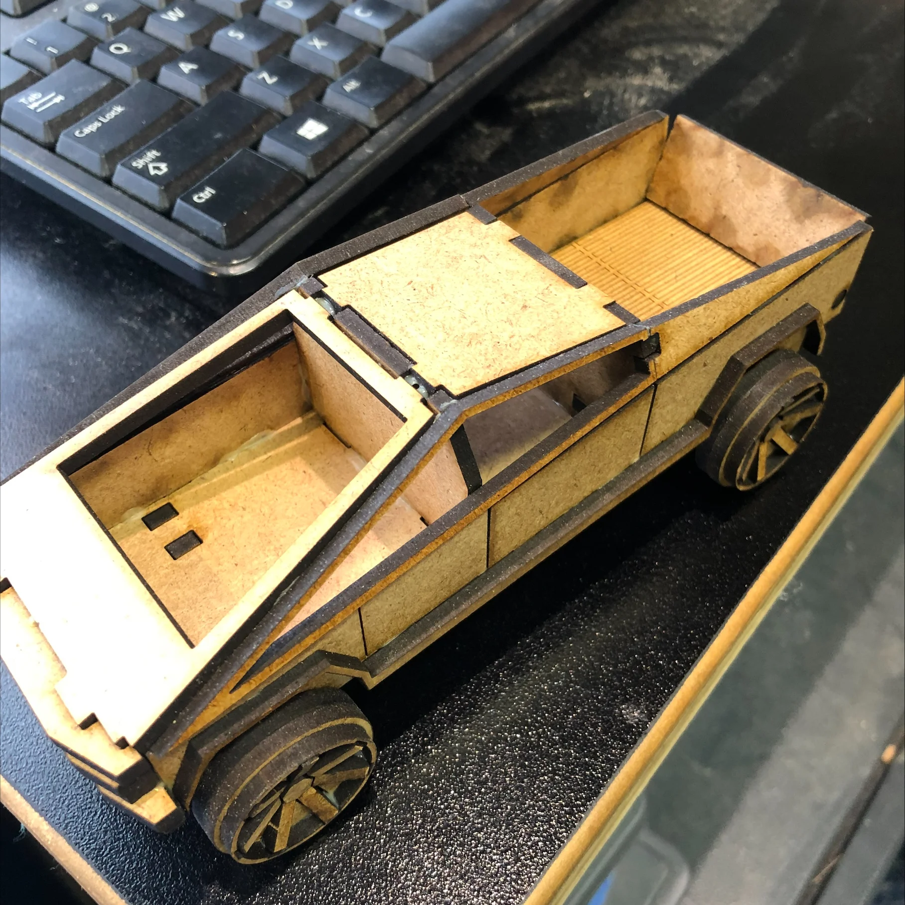

# Laser Cut Cybertruck Puzzle

A 3D puzzle model of the Tesla Cybertruck, designed for laser cutting. The angular, polygonal design of the Cybertruck makes it perfect for flat-pack laser cut construction.

## Features

- **Slot-together assembly** — No glue required, pieces interlock
- **Functional wheels** — Circular wheel design with spoke details
- **Open truck bed** — Just like the real thing
- **Detailed body panels** — Angular design captures the Cybertruck aesthetic

## Files

| File | Description |
|------|-------------|
| `Puzzle_laser_cut.dxf` | Complete cut file with all pieces |

## Cutting Instructions

### Material
- **Recommended:** 3mm MDF or 1/8" plywood
- Acrylic would also work but may be more brittle at the joints

### Laser Settings (adjust for your machine)
- **Cut lines:** Full power, appropriate speed for your material thickness
- **Engrave lines:** Lower power for surface details (windows, panel lines)

### Tips
- Do a test cut on scrap material first to dial in your settings
- MDF gives nice burnt edges that add to the aesthetic
- Keep pieces organized as you pop them out — there are a lot of small parts!

## Assembly

1. Pop out all pieces from the cut sheet
2. Start with the floor/chassis piece
3. Attach the side panels using the tab slots
4. Add the front and rear sections
5. Install the wheels last

No glue needed if tolerances are correct, but a small amount of wood glue can make it permanent.

## Design Notes

The Cybertruck's angular design translates naturally to laser cutting since it's already composed of flat planes and straight edges. This makes it one of the easier vehicles to recreate as a flat-pack puzzle.

## Disclaimer

The DXF file contains a company name from a previous competition submission. **I am not affiliated with that company** — it was simply a requirement of the competition entry format. This is an independent personal project.

## License

Personal/educational use. This is a fan project and is not affiliated with or endorsed by Tesla, Inc.
